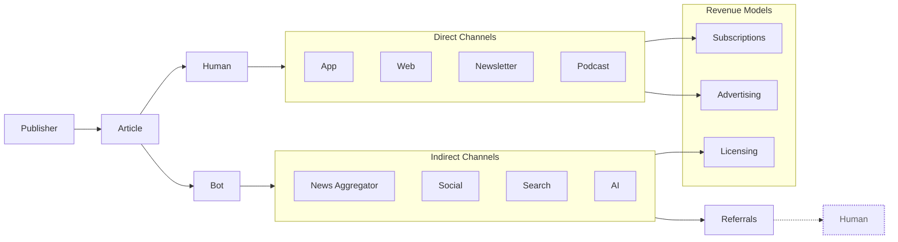

[Home](slide-01-title.md) | [Prev](slide-01-title.md) | [Next](slide-03-value-exchange-models.md) | [End](slide-16-appendix-research.md)

# The Content Value Matrix

Content is consumed by users and revenue is generated as follows:

