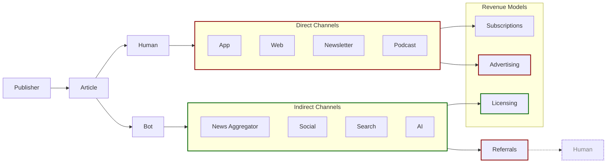
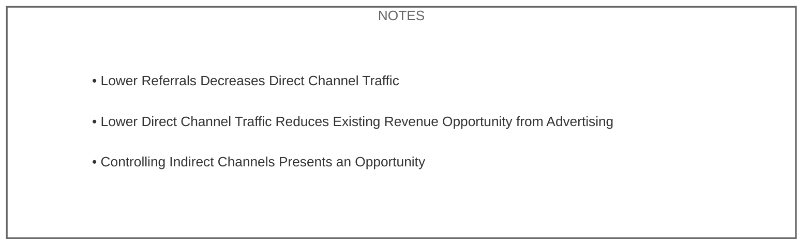

[Home](slide-01-title.md) | [Prev](slide-01-title.md) | [Next](slide-03-decline-in-referrals.md) | [End](slide-16-appendix-research.md)

# Content Distribution and Revenue

```mermaid

flowchart LR

      subgraph Direct_Channels["Direct Channels"]
            App["App"]
            Web["Web"]
            Newsletter["Newsletter"]
            Podcast["Podcast"]
      end

      subgraph Indirect_Channels["Indirect Channels"]
            News["News Aggregator"]
            Social["Social"]
            Search["Search"]
            AI["AI"]
      end

      subgraph Revenue["Revenue Models"]
            Subscriptions["Subscriptions"]
            Advertising["Advertising"]
            Licensing["Licensing"]
      end

      Publisher["Publisher"] --> Article["Article"]
      Article --> Human["Human"] & Bot["Bot"]
      Human --> Direct_Channels
      Indirect_Channels --> Referrals["Referrals"] & Licensing
      Direct_Channels --> Subscriptions & Advertising
      Bot --> Indirect_Channels
      Referrals -.-> H2["Human"]

      style H2 stroke-width:2px, stroke-dasharray:2, color:gray
      style Direct_Channels stroke-width:2px, stroke:darkred
      style Indirect_Channels stroke-width:2px, stroke:darkgreen
      style Advertising stroke-width:2px, stroke:darkred
      style Referrals stroke-width:2px, stroke:darkred
      style Licensing stroke-width:2px, stroke:darkgreen
```

   

```mermaid
flowchart TD
    subgraph Notes["NOTES"]
        direction TB
        Content["<div style='text-align:left; width:800px'>
        • Lower Referrals Decreases Direct Channel Traffic<br/>
        • Lower Direct Channel Traffic Reduces Existing Revenue Opportunity from Advertising<br/>
        • Controlling Indirect Channels Presents an Opportunity
        </div>"]
    end

    style Notes fill:none,stroke:#666,stroke-width:2px,color:#666
    style Content fill:none,stroke:none

```
