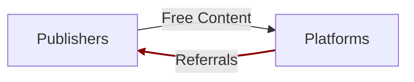
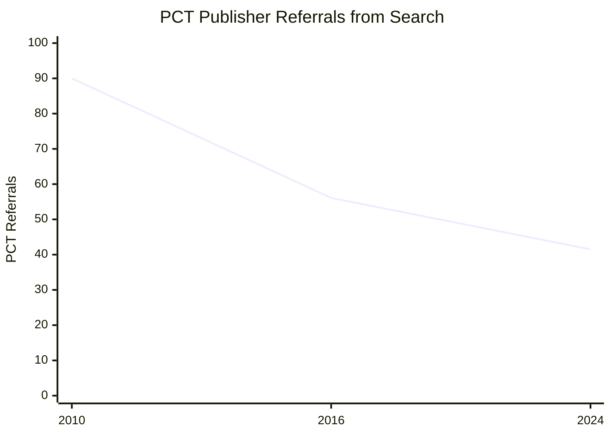
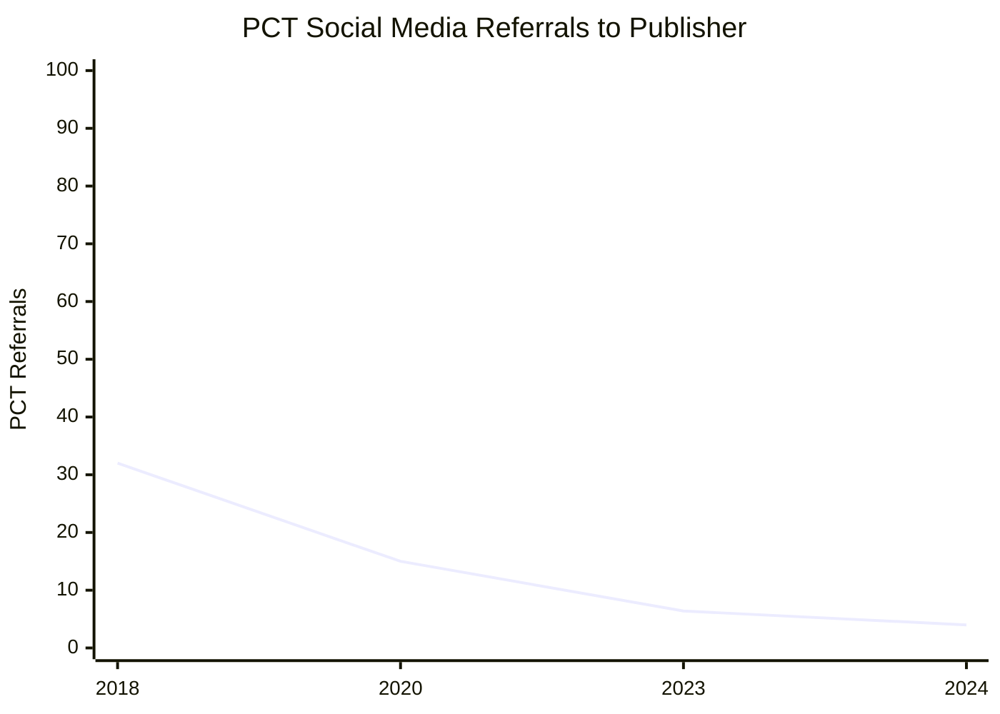
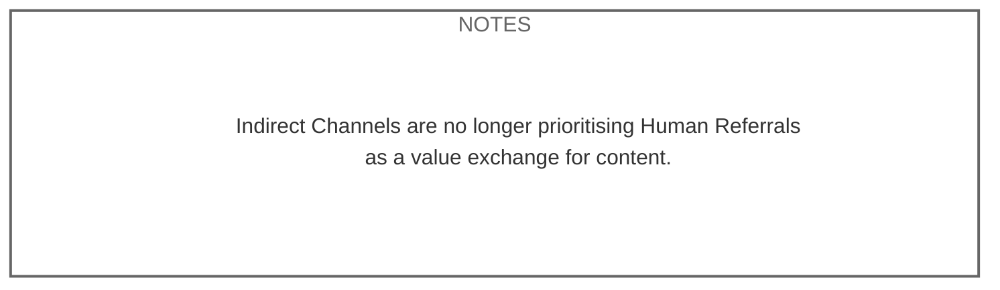

[Home](slide-01-title.md) | [Prev](slide-02-the-content-value-matrix.md) | [Next](slide-04-value-exchange-models.md) | [End](slide-16-appendix-research.md)

# Direct Traffic in Decline, Driven by Lower Referrals

 

 

#### • Platforms keep users on their site longer, therefore lower referrals
#### • Users can read content on platforms, no need to navigate to publisher directly

   

## Referrals from Search Engines

###### *Note: Graph generated from AI research of many sources.  Direct citation needed*

 

#### • Zero click searches have increased significantly over the last 10 years
#### • Even though search continues to grow, the percentage of search users that navigate to a publisher continues to decrease

   

## Referrals from Social Media

###### *Note: Graph generated from AI research of many sources.  Direct citation needed*

 

#### • Referrals from Social media have never been as good as search
#### • Regardless referrals continue to decline as Social platforms try harder to keep traffic on their own site

   

### Referrals are Increasingly Not Human

```mermaid
xychart-beta
    title "Human vs Bot Referrals by Platform PCT"
    x-axis ["Search", "Social", "Video", "AI"]
    y-axis "Percentage" 0 --> 100
    bar [100, 100, 100, 100]
    bar [30, 20, 5, 0.1]
```

###### *Note: Graph generated from AI research of many sources.  Direct citation needed*

 

