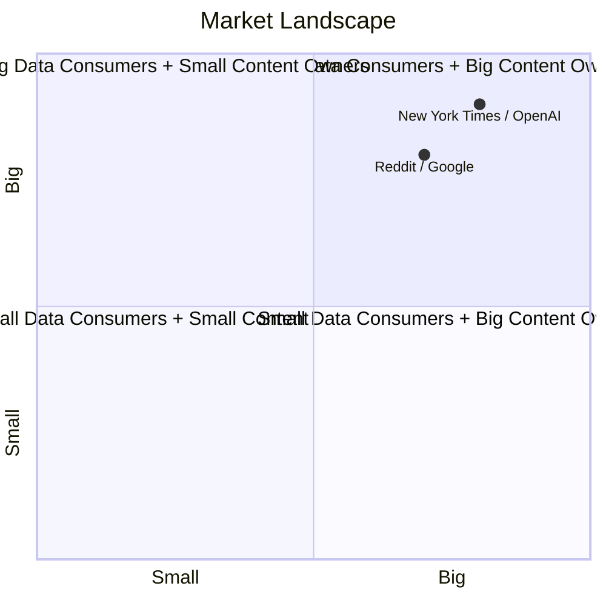
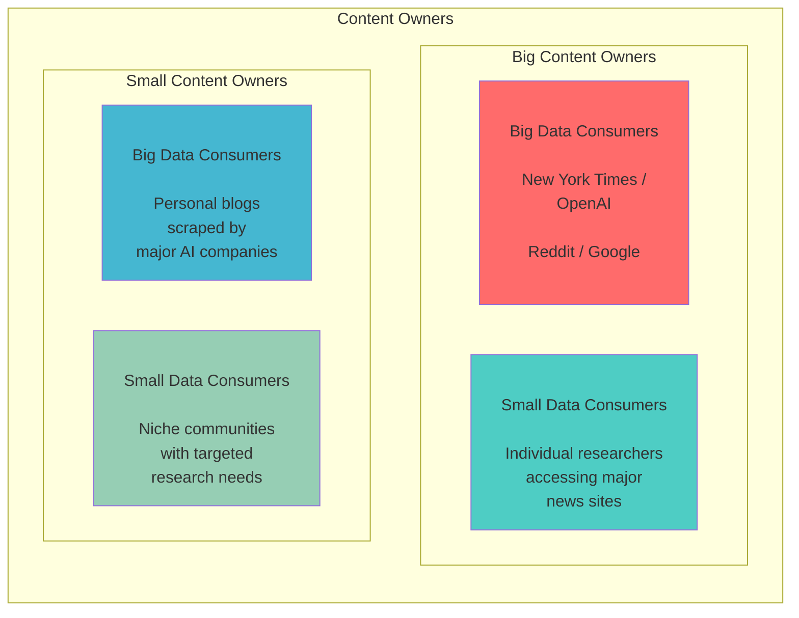

# Slide 4: Market Landscape

## 2x2 Market Matrix: Content Owners vs Data Consumers

## Alternative Mermaid Diagram (Grid Style)

## Key Market Dynamics

- **Top Right (Big/Big)**: High-value partnerships with complex licensing needs
- **Top Left (Small Content/Big Consumers)**: Power imbalance, need for protection
- **Bottom Right (Big Content/Small Consumers)**: Access control and fair pricing
- **Bottom Left (Small/Small)**: Simplified, affordable solutions

## CAF Value Proposition

Content Access Framework addresses the needs of all four quadrants by providing:
- Scalable licensing for any content owner size
- Flexible access controls for any consumer size
- Standardized protocols that work across the ecosystem
- Fair value exchange regardless of participant size