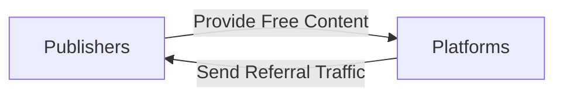
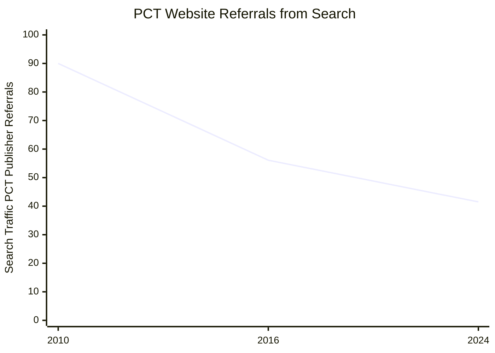
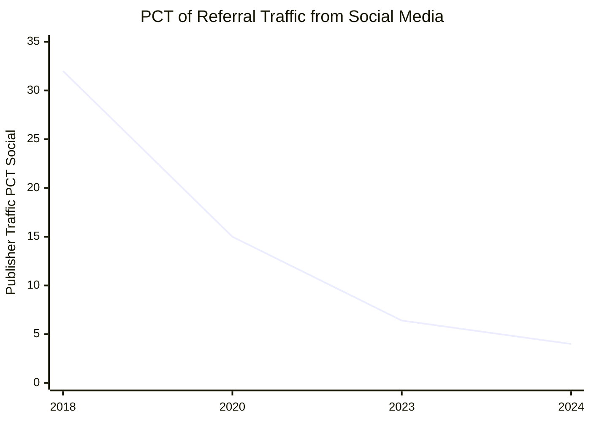
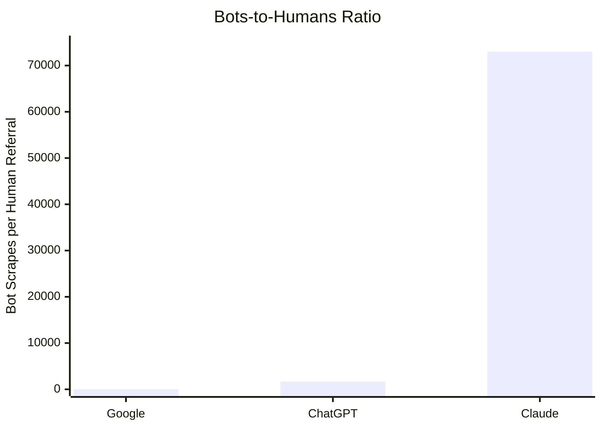

[Home](slide-01-title.md) | [Prev](slide-03-value-exchange-models.md) | [Next](slide-05-content-creator-choices.md) | [End](slide-16-appendix-research.md)

# The Broken Promise

The original implicit agreement between content creators and platforms was simple:

### Referrals from Search Engines

The Search engines used to refer 90% of searches to publishers.  Now, less than a third of searches results in a referral.

### Referrals from Social Media and Video

Social Media and Video display a similar downward trend.

### AI Platform Impact: AI Refers Agents, not Humans

AI platforms consume content at unprecedented scale.  However, AI (particularly Claude) does not refer Human traffic, but rather deploys Agents to read and process content. While this is valuable, there needs to be another monetisation method for content owners.

