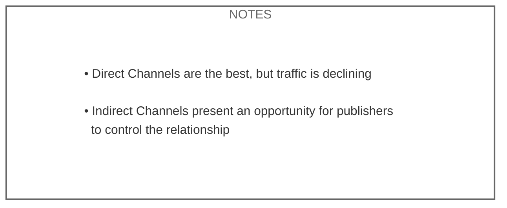

[Home](slide-01-title.md) | [Prev](slide-03-decline-in-referrals.md) | [Next](slide-05-content-creator-choices.md) | [End](slide-16-appendix-research.md)

# Opportunities for Publishers by Channel

| Channel                                                                | Ads | Subscriptions | Licensing |User Relationship | Referrals | Content | Branding |
|------------------------------------------------------------------------|-------|-------------|-----------|------------------|-----------|---------|----------|
| ● **App**              | Yes   | Yes         | -         | Yes              | -         | Yes     | Yes      |
| ● **Web**              | Yes   | Yes         | -         | Yes              | -         | Yes     | Yes      |
| ● **Email Newsletter** | Yes   | Yes         | -         | Yes              | -         | Yes     | Yes      |
| ● **Podcast**     | Share | Share       | Yes       | Limited          | No        | Yes     | Limited  |
| ● **News Aggregator**   | Share | Share       | Yes       | No               | Limited   | Yes     | Limited  |
| ● **Video**       | Share | No          | Maybe     | No               | No        | Yes     | Limited  |
| ● **Search**      | No    | No          | Yes       | No               | Limited   | Limited | No       |
| ● **Social**      | No    | No          | Maybe     | No               | Limited   | Limited | Limited  |
| ● **AI**                 | No    | No          | Yes       | No               | No        | No      | No       |

   

