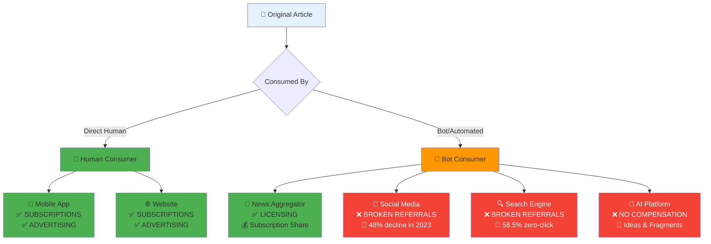
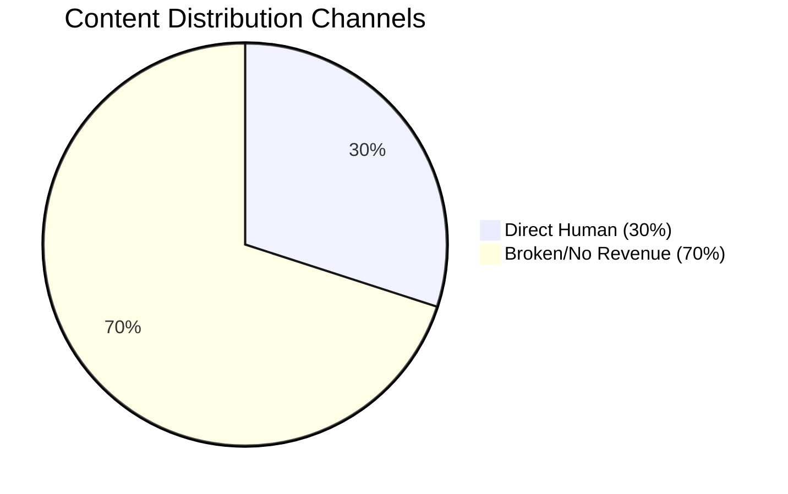

[Home](slide-01-title.md) | [Prev](slide-04-the-broken-promise.md) | [Next](slide-06-market-landscape.md) | [End](slide-16-appendix-research.md)

# Slide 5: Content Creator Choices Today

## Current Revenue Models vs. Content Value Matrix

## The Problem: Broken Revenue Streams

| Distribution Path | Revenue Model | Status | Impact |
|------------------|---------------|--------|---------|
| **Direct Human Access** | ✅ Subscriptions ✅ Advertising | Working | Sustainable revenue |
| **News Aggregators** | ✅ Licensing ✅ Revenue sharing | Working | Negotiated partnerships |
| **Social Media** | ❌ Referral traffic | **BROKEN** | 48% decline (Reuters 2024) |
| **Search Engines** | ❌ Referral traffic | **BROKEN** | 58.5% zero-click (SparkToro 2024) |
| **AI Platforms** | ❌ No compensation | **BROKEN** | Content fragmented without attribution |

## The Gap: 70% of Content Distribution Has No Revenue Model

## Content Creators Need New Solutions

**Current Working Models:**
- ✅ **Direct Subscriptions** - Sustainable but limited audience
- ✅ **Direct Advertising** - Works but declining effectiveness
- ✅ **Licensing to Aggregators** - Good but limited partners

**Broken Models Requiring CAFE:**
- 🔴 **Social Media** - Referrals declining rapidly
- 🔴 **Search Engines** - Zero-click searches dominating
- 🔴 **AI Platforms** - No compensation for content fragmentation

