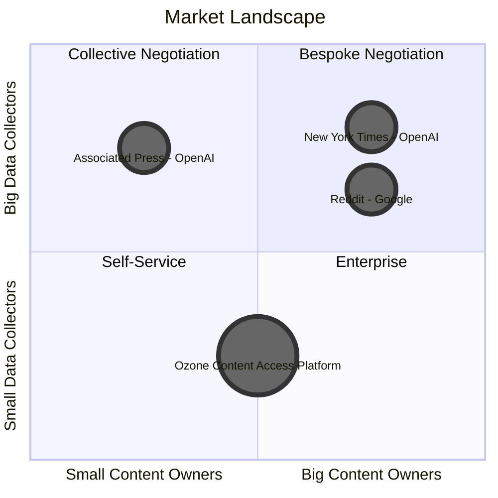

[Home](slide-01-title.md) | [Prev](slide-05-content-creator-choices.md) | [Next](slide-07-introducing-cafe.md) | [End](slide-16-appendix-research.md)

# Slide 6: Market Landscape

## Content Owner and Data Collector Market Matrix

## Key Market Dynamics

| Quadrant | Access Model | License | Lead Party | Pricing | Description |
|----------|--------------|---------|------------|---------| ----------- |
| **Bespoke** | Push | Custom | Publisher | $$$$ | Publisher negotiates directly.  Terms likely access rights or flexible license |
| **Collective** | Push | Custom | Ozone | $$$ | Ozone negotiates on publishers' behalf.  Flexible license |
| **Enterprise** | Pull | Tiered | Ozone | $$ | Data API - tiered pricing based on data elements and license |
| **Self Service** | Pull | Restrictive | Ozone | $$ | Data API - more restrictive license |

