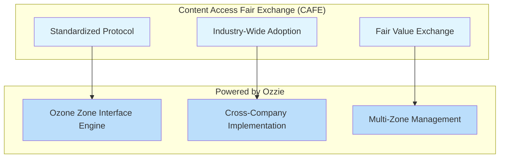

[Home](slide-01-title.md) | [Prev](slide-06-market-landscape.md) | [Next](slide-08-content-creator-ui.md) | [End](slide-16-appendix-research.md)

# Slide 7: Introducing CAFE

## Content Access Fair Exchange (CAFE)
*An industry standard protocol for content access and fair licensing exchange*

### What is CAFE?

CAFE creates a standardized ecosystem where content owners and data collectors can interact fairly and efficiently across all market segments.

## CAFE Value Proposition

Content Access Fair Exchange addresses the needs of all four quadrants by providing:

- **Scalable licensing** for any content owner size
- **Flexible access controls** for any consumer size  
- **Standardized protocols** that work across the ecosystem
- **Fair value exchange** regardless of participant size

## Key Benefits

| Benefit | Description |
|---------|-------------|
| **Unified Standard** | Single protocol replaces fragmented approaches |
| **Cross-Market Solution** | Works from self-service to bespoke negotiations |
| **Technology Platform** | Ozzie provides the implementation infrastructure |
| **Industry Adoption** | Like RTB, designed for broad ecosystem participation |

## The CAFE Difference

Unlike current ad-hoc solutions, CAFE provides a comprehensive framework that standardizes content access while maintaining flexibility for different market needs.

