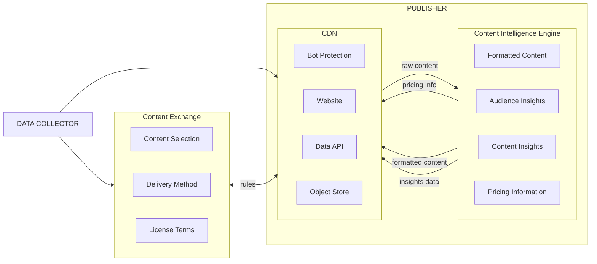
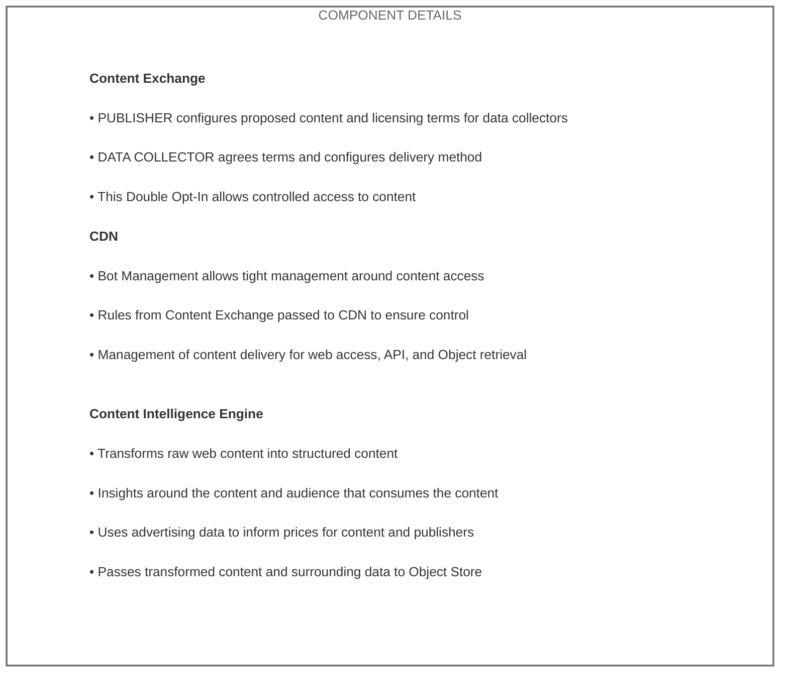

[Home](slide-01-title.md) | [Prev](slide-07-market-landscape.md) | [Next](slide-09-introducing-ozone-cafe.md) | [End](slide-16-appendix-research.md)

# Content Access Workflow

```mermaid
flowchart LR
    subgraph Publisher["PUBLISHER"]
        direction LR
        subgraph Ozzie["Content Intelligence Engine"]
            direction LR
            OZ1[Formatted Content]
            OZ2[Audience Insights]
            OZ3[Content Insights]
            OZ4[Pricing Information]
        end
        subgraph CDN
            direction LR
            BotProtection["Bot Protection"]
            Website
            DataAPI[Data API]
            ObjectStore[Object Store]
        end
    end

    Collector["DATA COLLECTOR"]
    
    subgraph CAFE["Content Exchange"]
        direction LR
        CAFE1["Content Selection"]
        CAFE2["Delivery Method"]
        CAFE3["License Terms"]
    end
    
    Collector --> CAFE
    Collector --> CDN
    CAFE <-->|rules| CDN
    CDN -->|raw content| Ozzie
    Ozzie -->|pricing info| CDN
    Ozzie -->|formatted content| CDN
    Ozzie -->|insights data| CDN
    
```

```mermaid
flowchart TD
    subgraph Notes["COMPONENT DETAILS"]
        direction TB
        Content["<div style='text-align:left; width:800px'>
        <b>Content Exchange</b><br/>
        • PUBLISHER configures proposed content and licensing terms for data collectors<br/>
        • DATA COLLECTOR agrees terms and configures delivery method<br/>
        • This Double Opt-In allows controlled access to content<br/>
        <b>CDN</b><br/>
        • Bot Management allows tight management around content access<br/>
        • Rules from Content Exchange passed to CDN to ensure control<br/>
        • Management of content delivery for web access, API, and Object retrieval<br/><br/>
        <b>Content Intelligence Engine</b><br/>
        • Transforms raw web content into structured content<br/>
        • Insights around the content and audience that consumes the content<br/>
        • Uses advertising data to inform prices for content and publishers<br/>
        • Passes transformed content and surrounding data to Object Store<br/>
        </div>"]
    end

    style Notes fill:none,stroke:#666,stroke-width:2px,color:#666
    style Content fill:none,stroke:none

```
