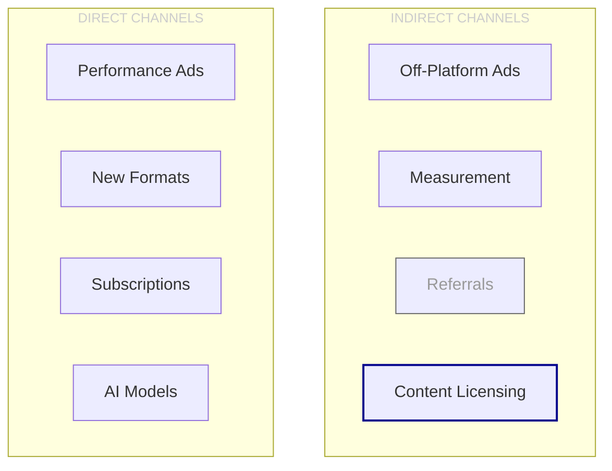
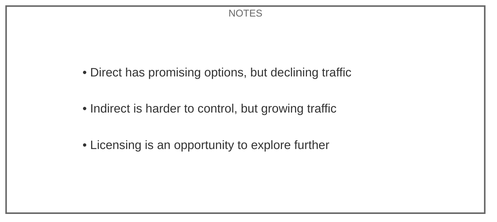

[Home](slide-01-title.md) | [Prev](slide-04-value-exchange-models.md) | [Next](slide-06-cafe-value-proposition.md) | [End](slide-16-appendix-research.md)

# Publisher Strategic Choices

```mermaid
flowchart TD
    subgraph Indirect[INDIRECT CHANNELS]
        direction LR
        Omnichannel["Off-Platform Ads"]
        Measurement
        Referrals["Referrals"]
        Licensing["Content Licensing"]
    end
    subgraph Direct[DIRECT CHANNELS]
        direction LR
        Performance["Performance Ads"]
        Formats["New Formats"]
        Subscriptions
        AI["AI Models"]
    end
    
    style Referrals stroke:#666666, color:#999999
    style Licensing stroke:darkblue, stroke-width:2px

    classDef small_title font-size:0.9em, color:#cccccc
    class Direct small_title
    class Indirect small_title
```

   

```mermaid
flowchart TD
    subgraph Notes["NOTES"]
        direction TB
        Content["<div style='text-align:left; width:500px'>
        • Direct has promising options, but declining traffic<br/>
        • Indirect is harder to control, but growing traffic<br/>
        • Licensing is an opportunity to explore further
        </div>"]
    end

    style Notes fill:none,stroke:#666,stroke-width:2px,color:#666
    style Content fill:none,stroke:none
    classDef small_title font-size:0.9em, color:#cccccc
    class Notes small_title

```

