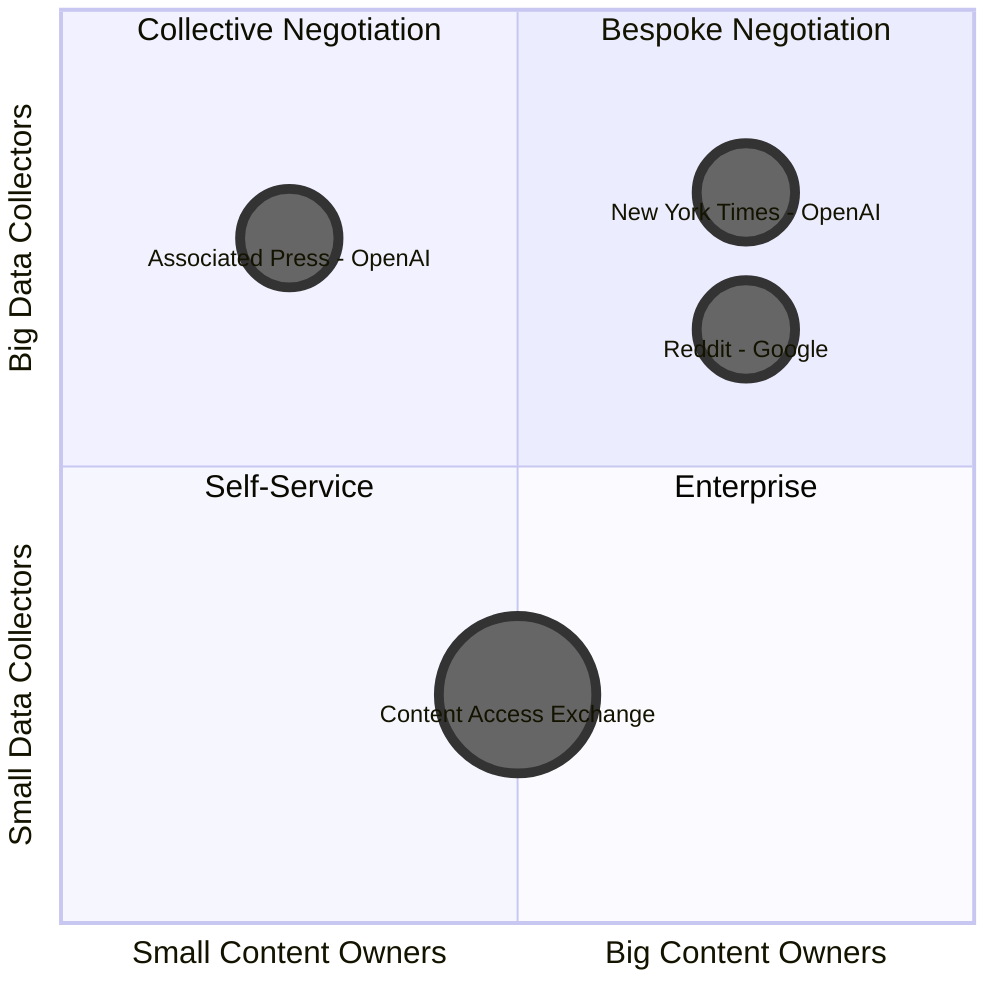

[Home](slide-01-title.md) | [Prev](slide-06-cafe-value-proposition.md) | [Next](slide-08-components-needed-for-content-access.md) | [End](slide-16-appendix-research.md)

# Content Licensing Market Landscape

   

NOTES
 

| Quadrant | License | Lead | Pricing | Description |
|----------|---------|------------|---------| ----------- |
| **Bespoke** | Custom | Publisher | $$$$ | Publisher negotiates directly.  Terms likely access rights or flexible license |
| **Collective** | Custom | Ozone | $$$ | Ozone negotiates on publishers' behalf.  Flexible license |
| **Enterprise** | Tiered | Ozone | $$ | Data API - tiered pricing based on data elements and license |
| **Self Service** | Restrictive | Ozone | $$ | Data API - more restrictive license |

